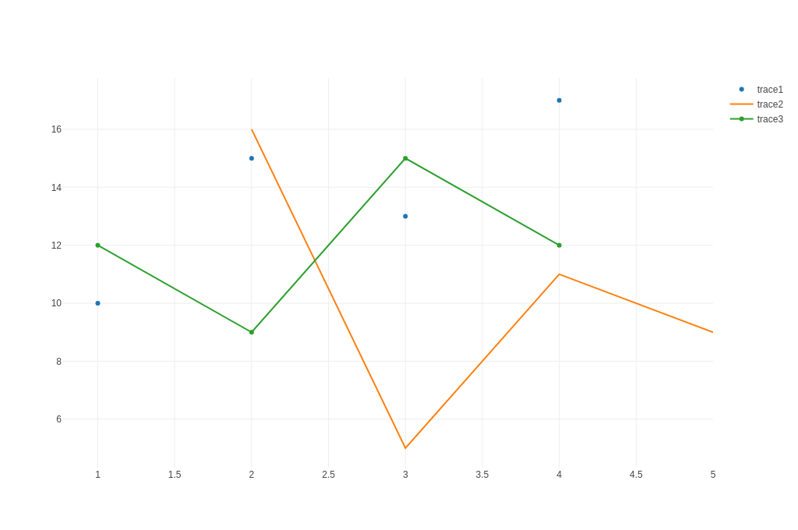

<div align="center">
    <a href="https://github.com/igiagkiozis/plotly/tree/master">
        
    </a>
    <a href="https://github.com/igiagkiozis/plotly/actions">
        
    </a>
    <a href="https://crates.io/crates/plotly">
        
    </a>
	<a href="https://docs.rs/plotly">
        
    </a>
    <a href="">
        
    </a>
</div>

# Getting Started

To start using [Plotly.rs](https://github.com/igiagkiozis/plotly) in your project add the following to your `Cargo.toml`:

```toml
[dependencies]
plotly = "0.6.0"
```

To add the ability to save plots in the following formats: png, jpeg, webp, svg, pdf and eps, you can use the `kaleido` feature. This feature depends on [plotly/Kaleido](https://github.com/plotly/Kaleido); a cross-platform library for generating static images. All the necessary binaries have been included with `plotly_kaleido` for `linux`, `windows` and `macos`. Previous versions of [Plotly.rs](https://github.com/igiagkiozis/plotly) used the `orca` feature; however this has been deprecated as it provided the same functionality but required additional installation steps. To enable the `kaleido` feature add the following to your `Cargo.toml` instead: 

```toml
[dependencies]
plotly = { version = "0.6.0", features = ["kaleido"] }
```

Plotly Kaleido is an open source project 


[Plotly.rs](https://github.com/igiagkiozis/plotly) has three main components: 

- Traces; these are containers for the data for display,
- Layout, fine tunes the display of traces on the canvas and more generally controls the way that the plot is displayed, and,
- Plot; is the component that brings traces and the layout together to display the plot in either html format or rasterise the resulting view.

All available traces (e.g. `Scatter`, `Bar`, `Histogram` etc), the `Layout` and `Plot` have been hoisted in the `plotly` namespace so that they can be imported simply using the following: 

```rust
use plotly::{Plot, Layout, Scatter};
```

The aforementioned components can be combined to produce as simple plot as follows: 
```rust
extern crate plotly;
use plotly::common::Mode;
use plotly::{Plot, Scatter};

fn line_and_scatter_plot() {
    let trace1 = Scatter::new(vec![1, 2, 3, 4], vec![10, 15, 13, 17])
        .name("trace1")
        .mode(Mode::Markers);
    let trace2 = Scatter::new(vec![2, 3, 4, 5], vec![16, 5, 11, 9])
        .name("trace2")
        .mode(Mode::Lines);
    let trace3 = Scatter::new(vec![1, 2, 3, 4], vec![12, 9, 15, 12]).name("trace3");

    let mut plot = Plot::new();
    plot.add_trace(trace1);
    plot.add_trace(trace2);
    plot.add_trace(trace3);
    plot.show();
}

fn main() -> std::io::Result<()> {
    line_and_scatter_plot();
    Ok(())
}
```

which results in the following figure: 



The above code will generate an html page of the `Plot` and display it in the default browser. The `html` for the plot is stored in the platform specific temporary directory. To save the `html` result the following can be used: 

```rust
plot.to_html("/home/user/line_and_scatter_plot.html");
```

It is often the case that plots are produced to be included in a document and a different format for the plot is desirable (e.g. png, jpeg etc). Given that the `html` version of the plot is composed of vector graphics, the display when converted to a non-vector format (e.g. png) is not guaranteed to be identical to the one displayed in `html`. This means that some fine tuning may be required to get to the desired output. To support that iterative workflow the `Plot` has `show_*` methods which display the rasterised output to the target format, for example this: 

```rust
plot.show_png(1280, 900);
```

will display in the browser the rasterised plot; 1280 pixels wide and 900 pixels tall, in png format. Once a satisfactory result is achieved, and assuming the `kaleido` feature is enabled, the plot can be saved using the following: 

```rust
plot.save("/home/user/plot_name.ext", ImageFormat::PNG, 1280, 900, 1.0);
```

The extension in the file-name path is optional as the appropriate extension (`ImageFormat::PNG`) will be included. Note that in all functions that save files to disk both relative and absolute paths are supported.
